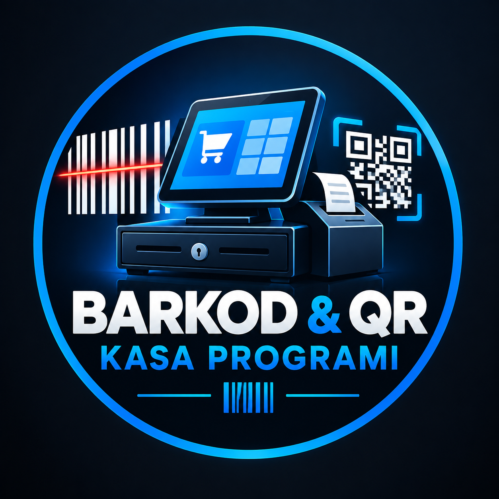

<div align="center">

  

  # 🚀 BARKOD & QR KASA VE STOK YÖNETİM OTOMASYONU

  **Çoklu Cihaz Senkronizasyonlu, Çevrimdışı (Offline) Destekli ve Rol Tabanlı Güvenlik Loglu Yeni Nesil POS Sistemi**

  [](https://reactjs.org/)
  [](https://dexie.org/)
  [](https://nodejs.org/)
  [](https://www.sqlite.org/)
  [](https://tailwindcss.com/)
  [](https://www.netlify.com/)
  [](LICENSE)

</div>

---

## 📌 Hakkında

**Barkod & QR Kasa Otomasyonu**, perakende sektöründe faaliyet gösteren işletmelerin hızlı satış yapmasını, stok sürekliliğini sürdürmesini ve cari/toptancı yönetimini gerçekleştirmesini sağlayan yüksek performanslı bir POS yazılımıdır.

İnternet kesintilerinde dahi **çevrimdışı (offline-first)** çalışma mimarisi sayesinde satışların aksamasını engeller. Çift yönlü senkronizasyon (Dual-Sync) parametreleri ile ana kasa bilgisayarı ile mobil terminal cihazları (telefon, tablet) arasında gerçek zamanlı veri dağılımı sağlar.

---

## 🏪 Hangi Sektörler İçin Uygundur?

Sistem tamamen modüler ve esnek bir altyapıya sahip olduğu için aşağıdaki sektörler ve benzeri tüm perakende/toptan işletmeler tarafından sorunsuz bir şekilde kullanılabilir:

* 🛒 **Market & Bakkallar:** Hızlı barkod okuma, terazi/kg satışları ve veresiye takibi.
* 🛠️ **Hırdavat & Yapı Marketler:** Çoklu birim yönetimi, seri stok araması ve detaylı faturalandırma.
* 📚 **Kırtasiye & Kitabevleri:** ISBN ve barkod sorgulama, ürün etiketi basımı.
* 🐶 **Petshoplar:** Çeşitli ürün kategorileri ve toptancı tedarik süreçleri.
* 👕 **Giyim & Bijuteriler:** Varyantlı ürün satışı ve QR kodlu barkod etiket basımları.
* 🔌 **Elektronik & Aksesuar Satıcıları:** Seri numaralı ürün takibi ve müşteri garanti kayıtları.

---

## ✨ Öne Çıkan Özellikler

### 📊 1. Gelişmiş Kasa Modülü (POS)
* **Hızlı Barkod ve QR Kod Okuma:** USB ve kablosuz barkod okuyucular ile tam uyum.
* **Kategori Bazlı Hızlı Erişim:** Tek tıkla ürün kategorilerine erişim ve sepet yönetimi.
* **Canlı Döviz Kuru Takibi:** TCMB üzerinden anlık USD, EUR ve GBP alış/satış kurları entegrasyonu.
* **Çoklu Ödeme Yöntemi:** Nakit, Kredi Kartı ve Veresiye (Cari) ödeme desteği.

### 📦 2. Stok ve Ürün Yönetimi
* Anlık stok miktarı takibi ve kritik stok seviyesi uyarıları.
* Dahili **Barkod & QR Kod Üretici** modülü ile etiket tasarımı ve basımı.
* Toplu fiyat güncelleme ve kategori yönetimi.

### 👥 3. Cari ve Toptancı Takibi
* **Müşteri (Cari) Hesabı:** Borç/alacak takibi, veresiye defteri ve müşteri hareketleri.
* **Toptancı Yönetimi:** Mal alımları, ödeme geçmişi ve tedarikçi borç bakiyeleri.

### 🔐 4. Güvenlik ve Tam Salt-Okunur Denetim Kaydı (System Logs / Audit Trail)
* **RBAC (Rol Tabanlı Erişim Kontrolü):** Süper Yönetici (Admin) ve Kasiyer rolleri. Yetkisiz sekme erişimlerine sistem düzeyinde engel.
* **Değiştirilemez Log Kayıtları:** Ürün silme, stok değiştirme, indirim ve fiyat güncellemeleri silinemez denetim günlüğü veri tabanına (`server.js` ve `db.js` üzerinden `SystemLogs.jsx`) işlenir.
* Sistem günlükleri güvenliği sağlamak adına kesinlikle müdahale edilemez ve sadece admin rolüne özeldir.

### 🔄 5. Hibrit Veri ve Senkronizasyon Mimarisi
* **Dual-Sync Teknolojisi:** İstemci tarafında IndexedDB (Dexie.js), sunucu tarafında SQLite3 entegrasyonu.
* İnternet veya yerel ağ koptuğunda işlemler yerelde birikir, bağlantı sağlandığında arka planda otomatik olarak senkronize olur.
* Local IP veya Cloud üzerinden çoklu cihaz desteği.

---

## 📐 Sistem Mimarisi

```text
       [ Mobil Cihaz / Tablet ]                  [ Masaüstü Kasa PC ]
 (React + Dexie.js + SPA Netlify)          (React + Dexie.js + SPA Netlify)
                │                                         │
                └───────────────────┬─────────────────────┘
                                    │ 
                                    │ Dual-Sync API (REST & Real-time)
                                    ▼
                       [ Node.js + Express Server ]
                        (server.js / db.js REST API)
                                    │
                       ┌────────────┴────────────┐
                       ▼                         ▼
            [ SQLite Master DB ]       [ Read-Only Audit Log ]
            (Ürünler, Cariler, vb.)     (SystemLogs Modülü)
